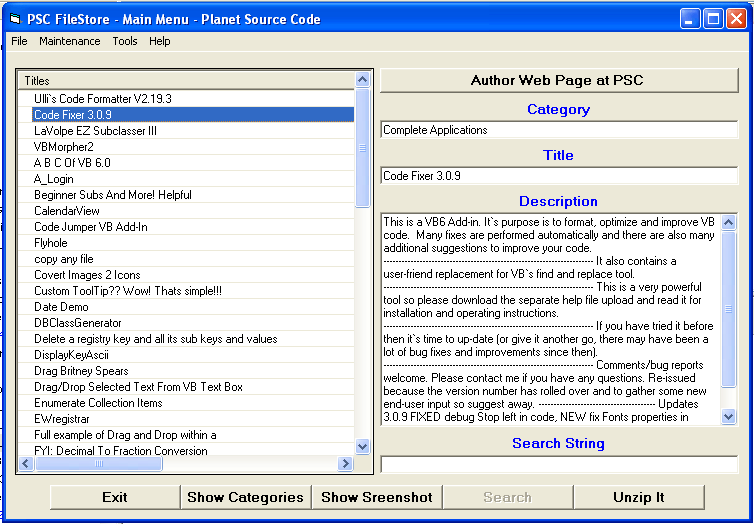



## PSC FileStore v1\.14

### Description

Collect code files from PSC and place the details

in a database for future search.

This code imports PSC ZIP files and can be moved

to various Categories of your choice.

Search can be done on All Categories or on individual category.

To achieve that the code will look in to the ZIP file for the

@PSC_ReadMe_???_?.txt to get the necessary details.

If this file is not found will look for a File_Id.Diz.

This is particularly important for me because I used to use it

before PSC came with the great idea of inserting a description

file in to the ZIP files.

If the page was saved then the code will look for the Screenshot file.

The @PSC_ReadMe_???_?.txt file doesn&#8217;t have the Category name

but if you have the Code of the Day emails (Plain Text) the program

can get the Category names from there.

Before you can use the program, two DLLs are needed from Info-Zip.

For more information please read the Readme file.

On this code, the comments are next to nothing.

This code is meant to be a tool and not a tutorial.

My apologies!

Comments and bugs found are very much welcomed!

Acknowledgments.

I used code or tools from (In alphabetic order);

AllAPI Guide, Info-Zip, Jim Jose, Lee Weiner, Raymond L. King,

Roger Gilchrist, Ulli and many other fine programmers that I don&#8217;t

have a record of.

Thank you to all these generous people!
 
### More Info
 
Before you can use the program, two DLLs are needed from Info-Zip.

             |
---                |---
**Submitted On**   |2005-08-12 21:11:20
**By**             |[George Inacio](https://github.com/Planet-Source-Code/PSCIndex/blob/master/ByAuthor/george-inacio.md)
**Level**          |Intermediate
**User Rating**    |4.7 (42 globes from 9 users)
**Compatibility**  |VB 6\.0
**Category**       |[Complete Applications](https://github.com/Planet-Source-Code/PSCIndex/blob/master/ByCategory/complete-applications__1-27.md)
**World**          |[Visual Basic](https://github.com/Planet-Source-Code/PSCIndex/blob/master/ByWorld/visual-basic.md)
**Archive File**   |[PSC\_FileSt1924438162005\.zip](https://github.com/Planet-Source-Code/george-inacio-psc-filestore-v1-14__1-62087/archive/master.zip)

